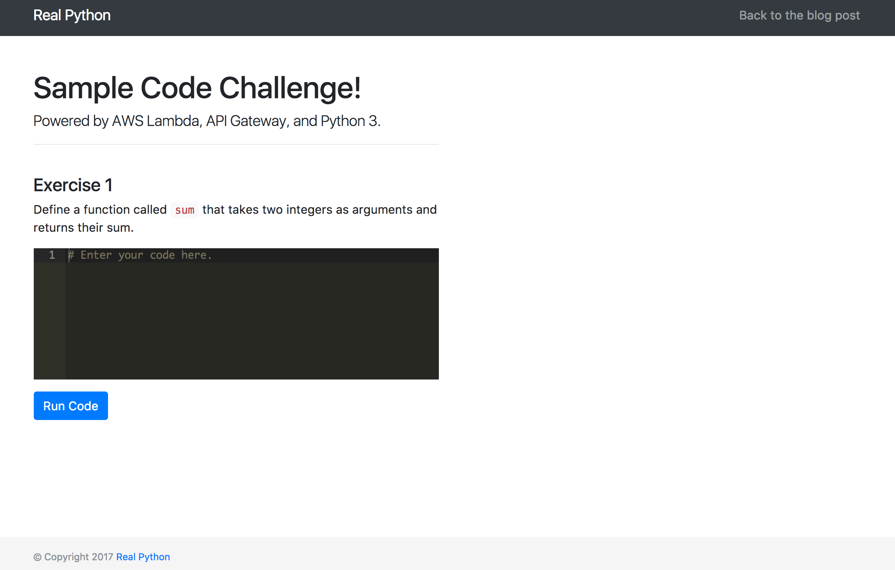
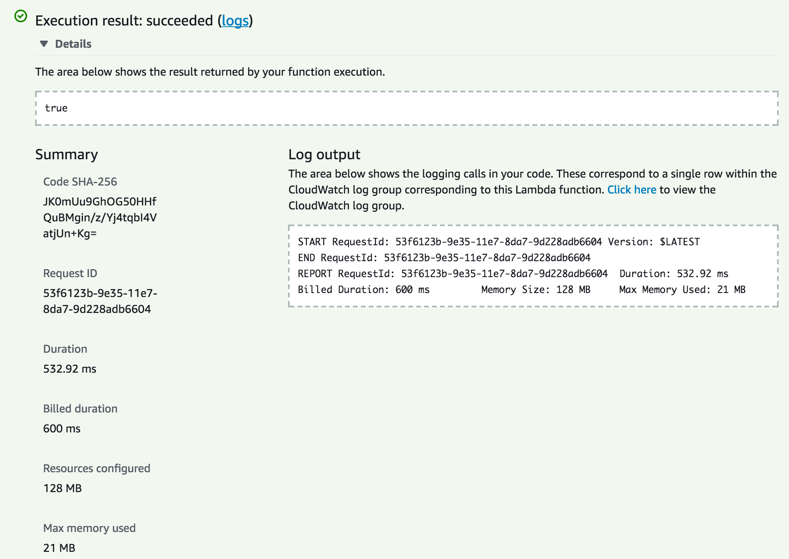
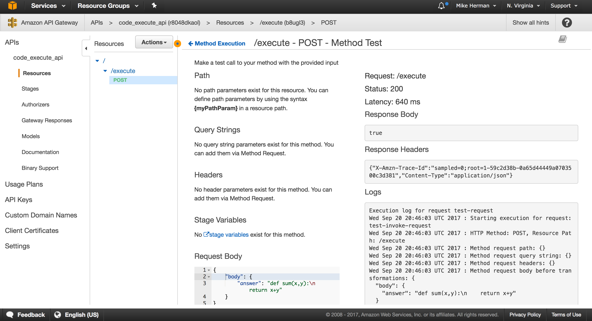

WIP

# Code Evaluation with AWS Lambda and API Gateway

This tutorial details how [AWS Lambda](https://aws.amazon.com/lambda/) and [API Gateway](https://aws.amazon.com/api-gateway/) can be used to develop a simple code evaluation API, where the end users submit code, via an AJAX form submission, which is then executed securely by a Lambda function.

ADD IMAGE

> **WARNING:** The code found in this tutorial is used to build toy app to prototype a proof of concept and is not meant for production use.

This tutorial assumes that you already have an account set up with [AWS](https://aws.amazon.com/). Also, we will use the `US East (N. Virginia)` / `us-east-1` region. Feel free to use the region of your choice. For more info, review the [Regions and Availability Zones](http://docs.aws.amazon.com/AWSEC2/latest/UserGuide/using-regions-availability-zones.html) guide.

## What is AWS Lambda?

Amazon Web Services (AWS) Lambda is an on-demand compute service that lets you run code in response to events or HTTP requests.

Use cases:

| Event                        | Action                   |
|------------------------------|--------------------------|
| Image added to S3            | Image is processed       |
| HTTP Request via API Gateway | HTTP Response            |
| Log file added to Cloudwatch | Analyze the log          |
| Scheduled event              | Backing up files         |
| Scheduled event              | Synchronization of files |

> **NOTE:** For more examples, review the [Examples of How to Use AWS Lambda](http://docs.aws.amazon.com/lambda/latest/dg/use-cases.html) guide from AWS.

In other words, you can run scripts and apps without having to provision or manage servers in a seemingly infinitely-scalable environment where you pay only for usage. This is "[serverless](https://martinfowler.com/articles/serverless.html)" computing in a nut shell. For our purposes, AWS Lambda is a perfect solution for running user-supplied code quickly, securely, and cheaply.

As of writing, Lambda [supports](https://aws.amazon.com/lambda/faqs/) code written in JavaScript (Node.js), Python, Java, and C#.

## Project Setup

Start by cloning down the base project:

```sh
$ git clone https://github.com/realpython/aws-lambda-code-execute \
  --branch v1 --single-branch
$ cd aws-lambda-code-execute
```

Then, check out the [v1](https://github.com/realpython/aws-lambda-code-execute/releases/tag/v1) tag to the master branch:

```sh
$ git checkout tags/v1 -b master
```

Open the *index.html* file in your browser of choice:



Once done, open the project in your code editor. Let's quickly review the code. Essentially, we just have a simple HTML form styled with [Bootstrap](http://getbootstrap.com/). The input field is replaced with [Ace](https://ace.c9.io/), an embeddable code editor, which provides basic syntax highlighting. Finally, within *assets/main.js*, a jQuery event handler is wired up to grab the code from the Ace editor, when the form is submitted, and send the data somewhere (eventually to API Gateway) via an AJAX request.

## Lambda Setup

Within the [AWS Console](https://console.aws.amazon.com), navigate to the main [Lambda page](https://console.aws.amazon.com/lambda) and click "Create a function". In the "Select blueprint" menu, click "Author from scratch" to start with a blank function. We'll set up the API Gateway integration later, so within the "Configure Triggers" simply click "Next".

Give the function a name, like `code_execute_python`, and add a basic description - `Execute user-supplied Python code`. Select "Python 3.6" in the "Runtime" drop-down.

Within the inline code editor, update the `lambda_handler` - which is the default entry point for Lambda - function definition with:

```python
import sys
from io import StringIO


def lambda_handler(event, context):
    # get code from payload
    code = event['answer']
    test_code = code + '\nprint(sum(1,1))'
    # capture stdout
    buffer = StringIO()
    sys.stdout = buffer
    # execute code
    try:
        exec(test_code)
    except:
        return False
    # return stdout
    sys.stdout = sys.__stdout__
    # check
    if int(buffer.getvalue()) == 2:
        return True
    return False
```

Here, we parse the JSON request body, passing the supplied code along with some test code - `sum(1,1)` - to the [exec](https://docs.python.org/3/library/functions.html#exec) function - which simply executes the string as Python code. Then, we simply ensure the actual results are the same as the expected and return the appropriate response.

Under "Lambda function handler and role", leave the default handler and then set the select "Create a new Role from template(s)" from the drop-down. Enter a "Role name", like `api_gateway_access`, and select " Simple Microservice permissions" for the "Policy templates", which provides access to [API Gateway](https://aws.amazon.com/api-gateway/).

Click "Next". And then create the function after a quick review.

Next click on the "Test" button to execute the newly created Lambda. Using the "Hello World" event template, replace the sample with:

```json
{
  "answer": "def sum(x,y):\n    return x+y"
}
```

Click the "Save and test" button at the bottom of the modal to run the test. Once done, you should see something similar to:



With that, we can move on to configuring the API Gateway to trigger the Lambda from user-submitted POST requests...

## API Gateway Setup

[API Gateway](https://aws.amazon.com/api-gateway/) is used to define and host APIs. In our example, we'll create a single HTTP POST endpoint that triggers the Lambda function when an HTTP request is received and responds with the results of the Lambda function, either `true` or `false`.

Steps:

1. Create the API
1. Test
1. Enable CORS
1. Deploy the API

### Create the API

To start, from the [API Gateway page](https://console.aws.amazon.com/apigateway), click the "Get Started" button to create a new API. Select "New API", and then provide a descriptive name, like `code_execute_api`. Then, create the API.

Select "Create Resource" from the "Actions" drop-down. Name the resource `execute`, and then click "Create Resource". With the resource highlighted, select "Create Method" from the "Actions" drop-down. Choose "POST" from the method drop-down. Click the checkmark next to it.

In the "Setup" step, select "Lambda Function" as the "Integration type", select the "us-east-1" region in the drop-down, and enter the name of the Lambda function that you just created.

Click "Save", and then click "OK" to give permission to the API Gateway to run your Lambda function.

### Test

To test, click on the lightning bolt that says "Test". Scroll down to the "Request Body" input and add the same JSON code we used with the Lambda function:

```json
{
  "answer": "def sum(x,y):\n    return x+y"
}
```

Click "Test". You should see something similar to:



### Enable CORS

Next, we need to enable [CORS](https://developer.mozilla.org/en-US/docs/Web/HTTP/Access_control_CORS) so that we can POST to the API endpoint from another domain.

With the resource highlighted, select "Enable CORS" from the "Actions" drop-down. For now, just use the defaults since we're still testing. It's important to note, that in production, you will want to replace `'*'` with the actual domain name of your website for "Access-Control-Allow-Origin*".

Click the "Enable CORS and replace existing CORS headers" button.

### Deploy the API

Finally, to deploy, select "Deploy API" from the "Actions" drop-down. Create a new "Deployment stage". Name it 'v1'. API gateway will generate a random subdomain for the API endpoint URL, and the stage name will be added to the end of the URL. You should now be able to make POST requests to a similar URL:

```
https://r8048dkaol.execute-api.us-east-1.amazonaws.com/v1/execute
```

Test via cURL:

```sh
$ curl -H "Content-Type: application/json" -X POST -d '{"answer":"def sum(x,y):\n    return x+y"}' https://r8048dkaol.execute-api.us-east-1.amazonaws.com/v1/execute
```

## Update the Form

Now, to update the form, first add the URL to the `grade` function in *assets/main.js*:

```javascript
function grade(payload) {
  $.ajax({
    method: 'POST',
    url: 'https://r8048dkaol.execute-api.us-east-1.amazonaws.com/v1/execute',
    dataType: 'json',
    contentType: 'application/json',
    data: JSON.stringify(payload)
  })
  .done((res) => { console.log(res); })
  .catch((err) => { console.log(err); });
}
```

Then, update the `.done` and `.catch()` functions, like so:


```javascript
function grade(payload) {
  $.ajax({
    method: 'POST',
    url: 'https://r8048dkaol.execute-api.us-east-1.amazonaws.com/v1/execute',
    dataType: 'json',
    contentType: 'application/json',
    data: JSON.stringify(payload)
  })
  .done((res) => {
    let message = 'Incorrect. Please try again.';
    if (res) {
      message = 'Correct!';
    }
    $('.answer').html(message);
    console.log(res);
    console.log(message);
  })
  .catch((err) => {
    $('.answer').html('Something went terribly wrong!');
    console.log(err);
  });
}
```

Now, if the request is a success, then the appropriate message will be added to an HTML element with the class of `answer`. Add this element, just below the HTML form within *index.html*:

```html
...
<form>
  <div class="form-group">
    <div id="editor" class="ace-editor"># Enter your code here.</div>
  </div>
  <button type="submit" class="btn btn-primary">Run Code</button>
</form>
<br>
<h5 class="answer"></h5>
...
```

Test it out!

## Next Steps

1. Production? 

Most applications will require more robust solutions with HTTPS, authentication, and data stores.
